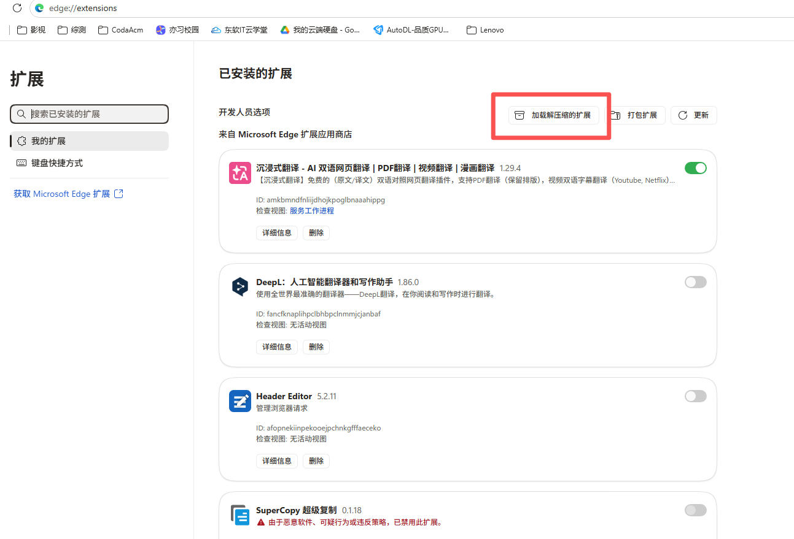
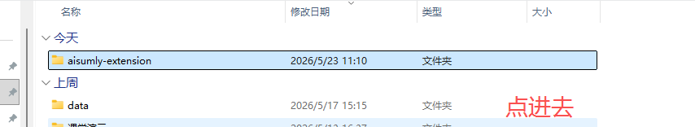
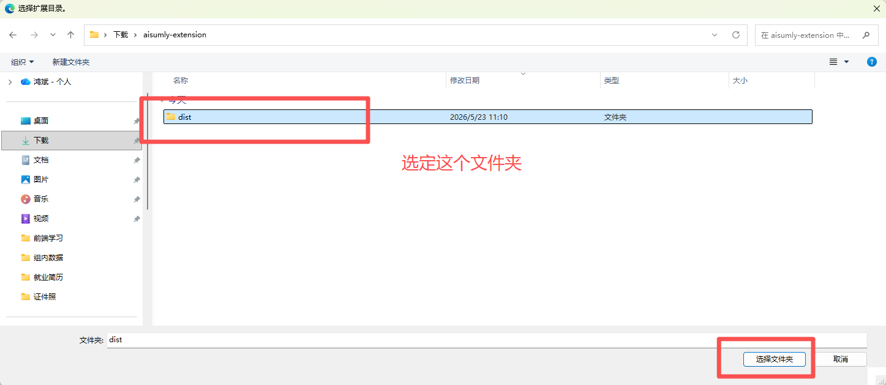
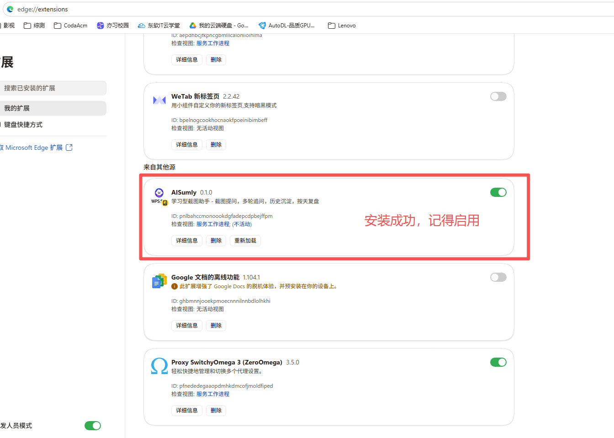
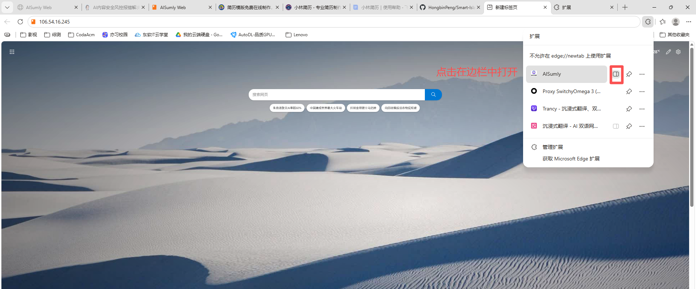
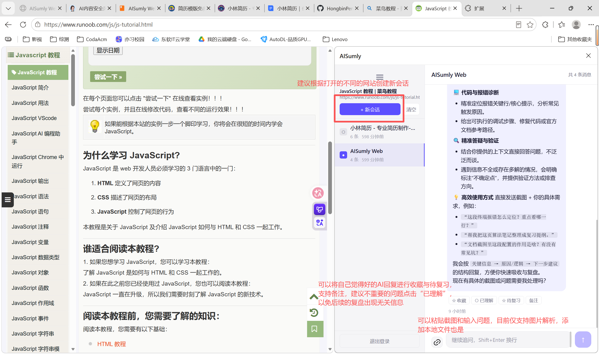
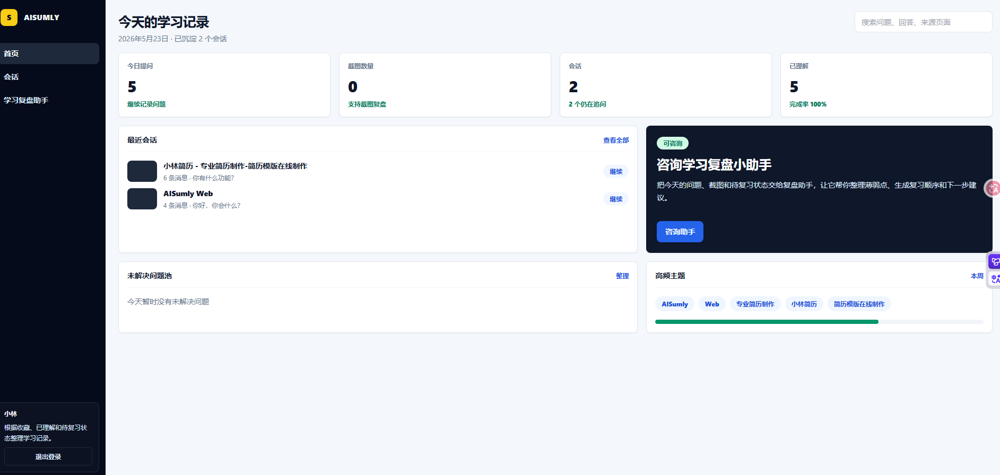
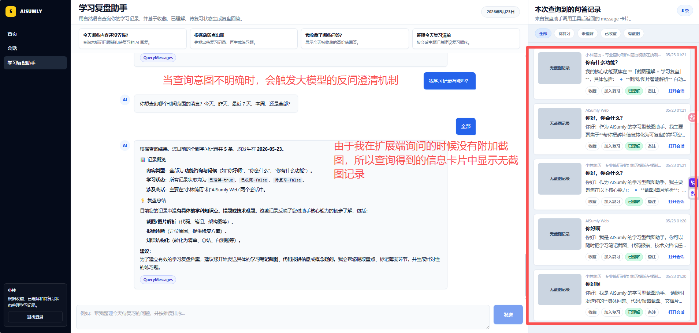

# AISumly

## 项目简介

AISumly 是一款学习型浏览器扩展，专为「边学习边提问」的场景设计。

之前学校开设了金山训练营，在学习的过程中，我常常需要借助大模型网页端解疑答惑，但是每次在大模型网页端和学习网站两个页面上***来回切换很麻烦**，并且有时大模型的回答很好，我后续可能接着**学习复盘**，但是现在主流大模型网页端又不支持学习复盘操作，所以我就开发了本项目。

本项目让你在遇到问题可以直接在当前网页右侧打开扩展提问，并扩展长期嵌入在右侧，**省去来回切换的麻烦**，另外，AI 的回答会按会话持久化保存，支持**后续在 Web 端通过“学习复盘小助手”功能进行复盘和总结。**

**解决的核心痛点**：
- 不需要在学习网页和 AI 网页之间来回切换
- 问答历史自动按会话组织，方便后续复习
- 支持按天生成学习复盘，过滤低价值内容，聚焦关键知识点

---

## 快速体验

### 1. 下载插件

访问 [体验地址](http://106.54.16.245/)，下载扩展端插件压缩包。

[扩展端插件下载](./docs/imgs/下载插件.png)

### 2. 安装插件

1. 解压下载的 `.zip` 文件
2. 浏览器地址栏输入 `chrome://extensions/`（或 `edge://extensions/`）
3. 开启「开发者模式」→「加载已解压的扩展程序」→ 选择解压后的文件夹





   



### 3. 打开侧边栏

安装后，点击浏览器工具栏的 AISumly 图标，或使用快捷键 `Alt+P` 在侧边栏中打开插件。



### 4. 注册/登录

注册后登录即可开始使用。当前版本暂未接入真实邮件服务，邮箱可随意填写。

### 5. 扩展端界面

登录成功后，界面如下：



**功能说明**：
- 支持**图片 + 文字**多模态输入，暂不支持 PDF、Word 等文件上传
- 支持多轮对话，同一会话内持续追问，上下文自动带入
- 可将 AI 回复标记为「已理解」「待复习」「收藏」，为后续复盘筛选做准备
- 自动记录提问时所在的网页 URL 和标题，方便后续追溯

**使用建议**：对话过程中，建议及时将已理解或低价值的 AI 回复标记为「已理解」，后续复盘时会自动过滤这些信息，避免干扰复盘效果。

**已知限制**：扩展端默认嵌入在网页右侧边栏，但部分网站（如 [学习 Eino 框架](https://golangstar.cn/go_agent_series/eino_basic/eino_chatmodel.html#_1-2-toolcallingchatmodel)）可能通过安全策略限制了嵌入行为，后续将探索解决方案。

### 6. Web 端

访问 [Web 端](http://106.54.16.245/) 登录后可使用以下功能：



### 7. 学习复盘小助手



**使用注意**：
- 查询条件不明确时，AI 会触发反问澄清机制，请根据提示补充更具体的条件（如时间范围、是否收藏、是否已理解、是否待复习等）
- 为节省 Token，列表页的 AI 回复会做截断展示，需点击卡片查看完整内容（包括图片、完整问答记录）
- 首次查询或复杂查询可能响应较慢，请耐心等待

---


## 部署

参照 .env.example 配置文件，修改数据库连接信息、Redis 配置等参数。后新建 .env 文件到项目根目录，将修改后的配置保存到该文件中。

之后可通过通过 Docker Compose 一键启动：

```bash
docker compose up -d
```

包含nginx、后端、 MySQL、Redis、RabbitMQ （暂时没用上）五个服务。

---

## 注意事项

1. 当前版本为 MVP 阶段，功能和稳定性仍在持续优化中
2. 扩展端和 Web 端共享同一套后端 API 和用户数据，问答记录统一存储
3. 请勿尝试对 AI 查询接口进行恶意 prompt 注入，可能导致查询结果异常
